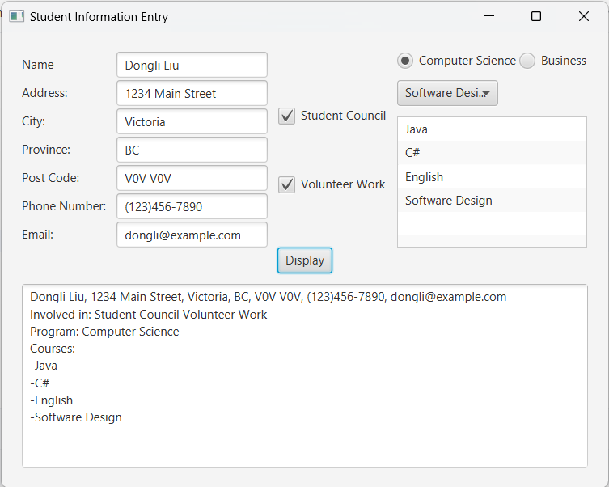

# JavaFX-StudentInfoEntry

## Overview
This project is a simple JavaFX practice, which provides basic functions to record student info and print it.

## Features
- Toggle choice box content when switching radio button
- Avoid repeating course selection
- Dynamic List View

## Technologies

- JavaFX Application
- Stage, Scene, Pane, FlowPane, HBox, VBox
- TextField, TextArea, CheckBox, ToggleGroup, RadioButton, ObservableList, ListView, Button, Label
- Event Handling
